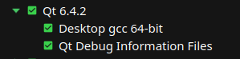
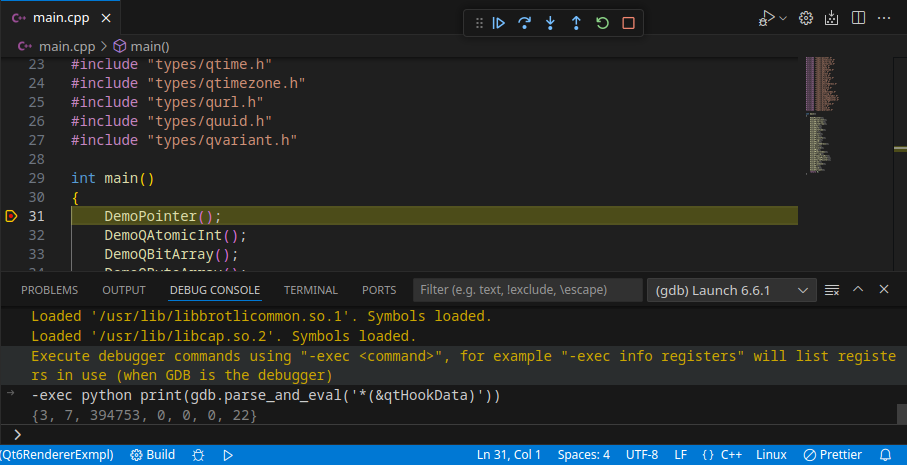
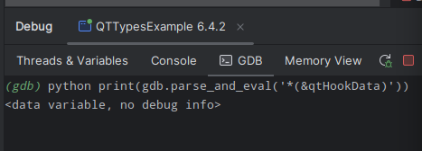
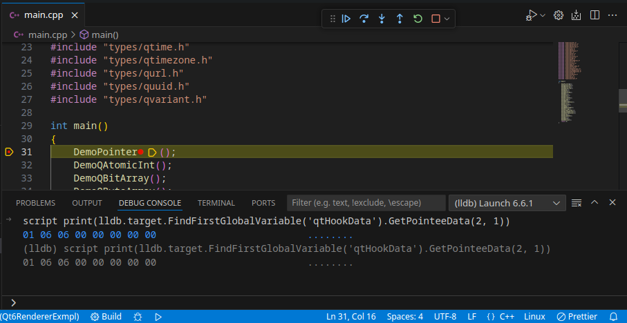
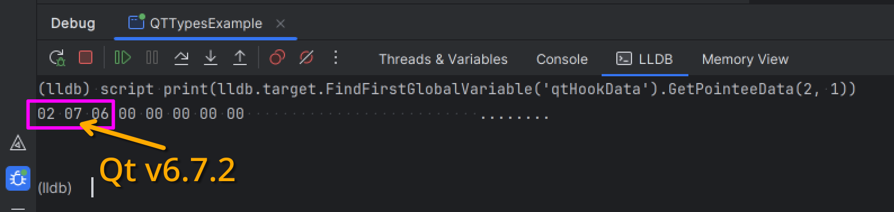

# QT6 Renderer

The set of scripts for pretty printing [Qt][qt] by [GDB][gdb] and [LLDB][lldb].

## IDE plugins
* [CLion][qt6renderer_intlj]
* [Visual Studio Code][qt6renderer_vsc]

## Qt versions support
* 6.x

## Qt types support
* [See here for GDB](./python/gdb)
* [See here for LLDB](./python/lldb)

You can use the [example project][qt6renderer_exmpl] for testsing.

## Debuggers support
* LLDB
* GDB

## Operating systems tested on
* Windows
* Linux  

## Architectures tested on
* x64

## Manual installation

> [!NOTE]
> Manual installation is an option if you prefer to run GDB executable without an IDE. Or if there is no plugin for your IDE. Or in any other situation when you know what you're doing.
>
> You do not need to install manually, if you use an IDE plugin.

### GDB

1. Copy the [qt6renderer](./python/gdb/qt6renderer/) folder somewhere at your system.
2. Place the [gdbinit](https://man7.org/linux/man-pages/man5/gdbinit.5.html) in the any of the supported places at your system.
3. Add the following content to the `gdbinit`:
   ```python
   python sys.path.append('/where/the/qt6renderer/folder/is/at/your/system') 
   # i.e. if the qt6renderer is at '~/gdb/scripts/qt6renderer'
   # then you add '~/gdb/scripts'
   python import qt6renderer
   python gdb.pretty_printers.append(qt6renderer.qt6_lookup)
   set print pretty on
   ```

## Requirements
Pretty printers need Debug information for `Qt`.

If you installed `Qt` with `Qt Online Installer`, ensure you have installed
the `Qt Debug Information Files`:



<details>
<summary>If you are using Arch Linux</summary>

Then you might wish to install `qt6-base-debug` package.
You can install manually (by specifying the url), or by enabling global repo. See [wiki](https://wiki.archlinux.org/title/Debugging/Getting_traces#Installing_debug_packages).

```
pacman -U https://geo.mirror.pkgbuild.com/extra-debug/os/x86_64/qt6-base-debug-6.7.2-1-x86_64.pkg.tar.zst
```
</details>

## Troubleshooting

### Qt Types are not pretty printed

1. Ensure you have satisfied [requirements](#requirements).
2. Ensure the proper `Qt` files loaded at runtime.

   > :large_blue_diamond: On Linux one might have `Qt` installed on the host system as a runtime libraries, for instance if the host system runs KDE. The debug target might load the `Qt` libraries from the host system, instead of the `Qt` development SDK.

   Run the command to check:

   <details>
    <summary>GDB</summary>

    ```
    info sharedlibrary
    ```

    Should print something like:
    
    ```
    0x00007ffff7e63940  0x00007ffff7f58b1a Yes /home/user/Qt/6.6.1/gcc_64/lib/libQt6Network.so.6
    0x00007ffff751f300  0x00007ffff7c0abe2 Yes /home/user/Qt/6.6.1/gcc_64/lib/libQt6Gui.so.6
    0x00007ffff6cb75e0  0x00007ffff70848eb Yes /home/user/Qt/6.6.1/gcc_64/lib/libQt6Core.so.6
    ```
   </details>

   <details>
    <summary>LLDB</summary>
        
    ```
    target modules list
    ````

    Should print something like:

    ```
    [  3] 0B3D90D4-3A24-26F8-2D28-E6FD902D2E1C-B1957B9C 0x00007ffff7e16000 /home/user/Qt/6.6.1/gcc_64/lib/libQt6Network.so.6 
      /home/user/Qt/6.6.1/gcc_64/lib/Qt6Network.debug
    [  4] 8D17CAB4-3968-A65B-FA7A-452CBB959B12-FE3D941E 0x00007ffff7400000 /home/user/Qt/6.6.1/gcc_64/lib/libQt6Gui.so.6 
      /home/user/Qt/6.6.1/gcc_64/lib/Qt6Gui.debug
    [  5] 70B3E481-9AFD-557A-D568-DB9065A3D74A-503165F0 0x00007ffff6c00000 /home/user/Qt/6.6.1/gcc_64/lib/libQt6Core.so.6 
      /home/user/Qt/6.6.1/gcc_64/lib/Qt6Core.debug
    ```
   </details>   
  
3. Ensure the `Qt` version supports pretty printing.   

   > :large_blue_diamond: There are problematic `Qt` versions, e.g. `6.4.2`, for which the debugger is unable to extract type metadata. Consider switching to another version of `Qt`.

   To check whether the `Qt` version has metadata, run:

   <details>
    <summary>GDB</summary>

    ```
    python print(gdb.parse_and_eval('*(&qtHookData)'))
    ```

    If degugger could read the metadata, it will print something like:
    
    ```
    {3, 7, 394754, 0, 0, 0, 22}
    ```

    

    

    Otherwise:

    ```
    <data variable, no debug info>
    ```

    
   </details>

   <details>
     <summary>LLDB</summary>

     ```
     script print(lldb.target.FindFirstGlobalVariable('qtHookData').GetPointeeData(2, 1))
     ```

     If degugger could read the metadata, it will print something like:
    
     ```
     02 07 06 00 00 00 00 00
     ```

     

     
   </details>


[qt]: https://www.qt.io/
[gdb]: https://sourceware.org/gdb/
[lldb]: https://lldb.llvm.org/
[qt6renderer_exmpl]: https://github.com/winseros/Qt6RendererExmpl
[qt6renderer_intlj]: https://github.com/winseros/Qt6RendererIntlj
[qt6renderer_vsc]: https://github.com/winseros/Qt6RendererVsc