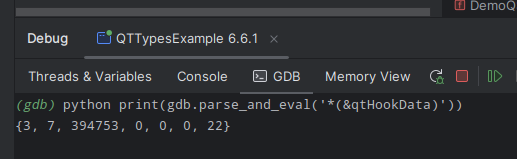

# QT6 Renderer

The set of scripts for pretty printing [Qt][qt] by [GDB][gdb] and [LLDB][lldb].

## IDE plugins
* [CLion][qt6renderer_intlj]
* [Visual Studio Code][qt6renderer_vsc]

## Qt versions support
* 6.x

## Qt types support
* [See here for GDB](./python/gdb)
* [See here for LLDB](./python/lldb)

You can use the [example project][qt6renderer_exmpl] for testsing.

## Debuggers support
* LLDB
* GDB

## Operating systems tested on
* Windows
  * Bundled LLDB 9
  * Bundled GDB 13 
* Linux
  * Bundled LLDB 13
  * Bundled GDB 13

## Architectures tested on
* x64

## Requirements

The scripts need `Qt Debug Information Files` to work.

If you installed Qt with Qt Online installer, ensure you have installed the appropriate item:


If you are using Arch Linux, you need to install `qt6-base-debug` package.
You can install manually (by specifying the url), or by enabling global repo. See [wiki](https://wiki.archlinux.org/title/Debugging/Getting_traces#Installing_debug_packages).
```
sudo pacman -U https://geo.mirror.pkgbuild.com/extra-debug/os/x86_64/qt6-base-debug-6.7.2-1-x86_64.pkg.tar.zst
```

## Manual installation

### GDB

1. Copy the [qt6renderer](./python/gdb/qt6renderer/) folder somewhere at your system.
2. Place the [gdbinit](https://man7.org/linux/man-pages/man5/gdbinit.5.html) in the any of the supported places at your system.
3. Add the following content to the `gdbinit`:
   ```python
   python sys.path.append('/where/the/qt6renderer/folder/is/at/your/system') 
   # i.e. if the qt6renderer is at '~/gdb/scripts/qt6renderer'
   # then you add '~/gdb/scripts'
   python import qt6renderer
   python gdb.pretty_printers.append(qt6renderer.qt6_lookup)
   set print pretty on
   ```

## Troubleshooting

### Qt Types are not pretty printed

First, ensure you have satisfied [requirements](#Requirements).

Open the example project in IDE. Set a breakpoint somewhere in the `main()` function, and start a debugging session.

Now click on the debugger console tab (this will be "GDB" or "LLDB" depending on toolchain you use), and enter the command
for a quick check if a specific version includes type metainfo.

For the gdb console, use command:
```
python print(gdb.parse_and_eval('*(&qtHookData)'))
```

For lldb console, use command:
```
script print(lldb.target.FindFirstGlobalVariable('qtHookData').GetPointeeData(2, 1))
```

There are problematic Qt versions, for which the debugger is unable to extract type metadata.

For example, for Qt 6.4.2 in gdb console you will get `<data variable, no debug info>` message:


Consider switching to another version of Qt.

For the supported Qt version, you will get some debug info.

For gdb, that looks like `{3, 7, 394754, 0, 0, 0, 22}`:



For lldb, that looks like `02 07 06 00 00 00 00 00`:


[qt]: https://www.qt.io/
[gdb]: https://sourceware.org/gdb/
[lldb]: https://lldb.llvm.org/
[qt6renderer_exmpl]: https://github.com/winseros/Qt6RendererExmpl
[qt6renderer_intlj]: https://github.com/winseros/Qt6RendererIntlj
[qt6renderer_vsc]: https://github.com/winseros/Qt6RendererVscj